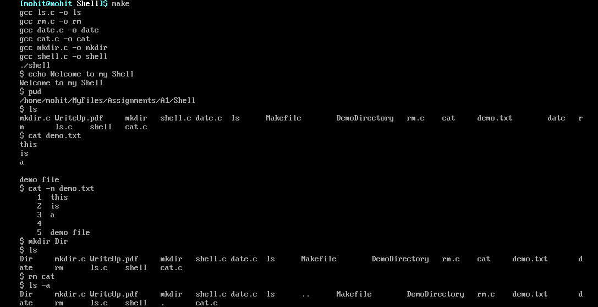

# Basic Linux Shell

## Overview
A basic linux shell designed and developed using **standard C libraries** and linux system calls such as `fork()`, `execl()`, `pthread_create()`, `system()`

Implemented **3 internal commands** in addition to **5 external commands** along with some command line options for each. Some corner cases have also been handled for each of them.




## Tech Stack

&nbsp; &nbsp; &nbsp; 

 
## Instructions
Run the following commands on the terminal

```bash
# clone this repository
git clone https://github.com/mohitg66/Basic-Linux-Shell.git
cd Basic-Linux-Shell

# compile the source
make
```

## Commands

- For **Process based execution**: Simply run the commands, for example
```
ls -a
```

- For **Thread based execution**: Add  `&t` before the command, for example
```
&t ls -a
```


### Internal Commands
#### **cd**
```
cd
cd -L
cd ..
```

#### **echo**
```
echo
echo -E
echo -n
```

#### **pwd**
```
pwd
pwd -L
pwd -P
```

### External Commands
#### **ls**
```
ls
ls -a
ls -p
```

#### **cat**
```
cat
cat -n
cat -e
```

#### **date**
```
date
date -R
date -I
date -a
```

#### **rm**
```
rm
rm -i
rm -f
rm -n
```

#### **mkdir**
```
mkdir
mkdir -v
mkdir -p
```


## Assumptions
- command line options other than the ones mentioned are invalid
-  `echo` no use of $
- `ls` works only for the current working directory, no path to be given
- `cat` can’t read multiple files at once
- `date` the shell uses the system’s date which may not be correctly synced
- `rm` cannot delete multiple files at once


## Author

**Mohit Gupta**

- GitHub: [mohitg66](https://github.com/mohitg66/)
- Email: [mohit21339@iiitd.ac.in](mailto:mohit21339@iiitd.ac.in)
